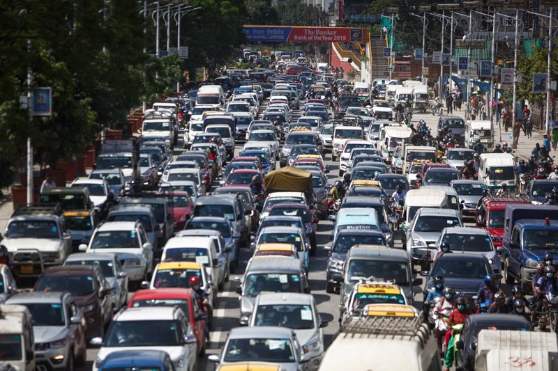

# Automatic Nepali Number Plate Recognition with Sms Reporting System

<!-- <strike>Real-Time-Machine-Learning-Approach-on-Traffic-Congestion-Prediction-System-in-Internet-of-Vehicles</strike> -->

# Real-Time-Machine-Learning-Approach-on-Traffic-Congestion-Prediction-System-in-Internet-of-Vehicles

### Team Kyzen
* [Khom Raj Thapa Magar](https://khomz.github.io/)
* [Keshav Raj Poudel](https://github.com/Keshav-46)

[[Click me!]](https://khomz.github.io/)

### Traffic Congestion

[Image SOurce](https://thehimalayantimes.com/uploads/imported_images/wp-content/uploads/2020/07/Traffic-Jam2.jpg)